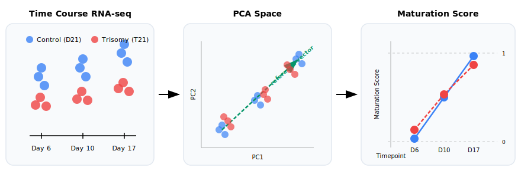
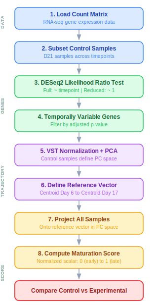

## Overview

PCA-based method for comparing differentiation
progression between conditions in bulk RNA-seq time
course data.

{width="100%"}

**Dataset.** Data from
[Martinez et al. (2024)](https://doi.org/10.3389/fncel.2024.1341141):
D21 (euploid control) and T21 (trisomy 21)
iPSC-derived neural progenitors at Days 6, 10,
and 17 (18 samples, 3 replicates per condition).

## Motivation

Standard differential expression compares conditions
at individual timepoints independently. This discards
the temporal structure of differentiation. A sample
that is transcriptionally "ahead" or "behind" will
appear differentially expressed at every timepoint,
but the underlying cause is a timing shift, not a
condition-specific program.

This method reduces the full transcriptomic trajectory
to a single scalar **maturation score** per sample,
enabling:

- Direct quantification of differentiation timing
  differences between conditions
- Detection of whether an experimental condition
  accelerates or delays differentiation
- Comparison across experiments that share a common
  reference time course

## Workflow

{width="55%"
fig-align="center"}

## Mathematical Framework

### Dimensionality Reduction via PCA

Given a VST-normalized expression matrix
$X \in \mathbb{R}^{p \times n}$ ($p$ genes, $n$
samples), center each gene across samples:

$$
x_{ij}^{c} = x_{ij}
  - \frac{1}{n}\sum_{k=1}^{n} x_{ik}
$$

Compute the sample covariance matrix and its
eigendecomposition:

$$
C = \frac{1}{n-1}
  \left(X^{c}\right)^{\!\top} X^{c}
\in \mathbb{R}^{n \times n},
\qquad
C\,\mathbf{v}_k = \lambda_k\,\mathbf{v}_k,
\qquad
\lambda_1 \geq \lambda_2 \geq \cdots
$$

The $k$-th principal component score for sample $i$
is the projection onto the $k$-th eigenvector:

$$
z_{ik} = \sum_{j=1}^{p} v_{kj}\, x_{ij}^{c}
$$

Each sample is represented by its first three PC
coordinates, which together capture the majority
of transcriptomic variance:

$$
\mathbf{z}_i = (z_{i1},\; z_{i2},\; z_{i3})
  \in \mathbb{R}^3
$$

Variance explained by each component:

$$
\textrm{VE}_k = \frac{\lambda_k}
  {\displaystyle\sum_{j=1}^{n}\lambda_j}
$$

### Centroid Vector

For a set of $n_t$ reference samples at timepoint
$t$, the centroid in PC space is:

$$
\bar{\mathbf{z}}_t
= \frac{1}{n_t}\sum_{i \in t}\mathbf{z}_i
$$

The reference differentiation vector connects the
earliest and latest control centroids:

$$
\vec{v}
= \bar{\mathbf{z}}_{t_{\textrm{late}}}
  - \bar{\mathbf{z}}_{t_{\textrm{early}}}
$$

### Maturation Score

Each sample is projected onto $\vec{v}$ and
normalized so the early centroid maps to 0 and the
late centroid maps to 1:

$$
s_i
= \frac{
    \left(\mathbf{z}_i
      - \bar{\mathbf{z}}_{t_{\textrm{early}}}\right)
    \cdot \vec{v}
  }{
    \lVert\vec{v}\rVert^2
  }
$$

---

## Analysis

### Setup

```{r}
#| label: setup
library(DESeq2)
library(ggplot2)
library(dplyr)
library(tidyr)
library(tibble)
library(plotly)
library(ComplexHeatmap)
library(circlize)
library(viridis)

meta <- readRDS("dat/metadata/WC24_metadata_clean.rds")
raw_counts <- readRDS(
  "dat/counts/raw/WC24_filt_raw_counts.rds"
)
vst_counts <- readRDS(
  "dat/counts/vst/WC24_vst_counts.rds"
)

meta$timepoint <- factor(
  meta$timepoint, levels = c(6, 10, 17)
)

theme_pub <- function(base_size = 10) {
  theme_classic(base_size = base_size) +
  theme(
    text = element_text(color = "black"),
    axis.text = element_text(
      size = base_size - 2, color = "black"
    ),
    axis.title = element_text(
      size = base_size - 1, color = "black"
    ),
    axis.line = element_line(
      color = "black", linewidth = 0.3
    ),
    axis.ticks = element_line(
      linewidth = 0.3, color = "black"
    ),
    panel.grid.major = element_line(
      color = "#D9D9D9", linewidth = 0.22
    ),
    panel.grid.minor = element_blank(),
    legend.title = element_blank(),
    legend.text = element_text(
      size = base_size - 2, color = "black"
    ),
    legend.key.size = unit(0.35, "cm"),
    strip.text = element_text(
      size = base_size - 1, face = "bold",
      color = "black"
    ),
    strip.background = element_blank()
  )
}

col_d21 <- "#1F78B4"
col_t21 <- "#E31A1C"
```

### Feature Selection: Likelihood Ratio Test

```{r}
#| label: lrt
#| cache: true

ctrl_meta <- meta[meta$genotype == "D21", ]
ctrl_counts <- raw_counts[, ctrl_meta$sample_id]

dds <- DESeqDataSetFromMatrix(
  countData = ctrl_counts,
  colData   = ctrl_meta,
  design    = ~ timepoint
)
dds <- DESeq(dds, test = "LRT", reduced = ~ 1)
res <- results(dds)
res <- res[order(res$padj), ]

sig_genes <- rownames(res)[
  !is.na(res$padj) & res$padj < 0.05
]
n_top <- min(1000, length(sig_genes))
top_genes <- head(rownames(res), n_top)

cat(
  "Significant genes (padj < 0.05):",
  length(sig_genes), "\n",
  "Genes used for PCA:", n_top
)
```

### Temporally Variable Gene Heatmap

```{r}
#| label: fig-heatmap
#| fig-cap: >
#|   Z-scored expression of temporally variable genes
#|   across D21 control timepoints (k=4 row clusters,
#|   viridis palette, winsorized at +/- 2)
#| fig-height: 4.5
#| fig-width: 4

hm_mat <- as.matrix(
  vst_counts[sig_genes, ctrl_meta$sample_id]
)
hm_z <- t(scale(t(hm_mat)))
hm_z[hm_z >  2] <-  2
hm_z[hm_z < -2] <- -2

col_fun <- colorRamp2(
  seq(-2, 2, length.out = 100),
  viridis(100)
)

ht <- Heatmap(
  hm_z,
  name                   = "Z-score",
  col                    = col_fun,
  cluster_columns        = FALSE,
  cluster_rows           = TRUE,
  clustering_method_rows = "ward.D2",
  row_km                 = 4,
  row_gap                = unit(2, "mm"),
  show_row_names         = FALSE,
  show_column_names      = FALSE,
  column_split           = factor(
    ctrl_meta[colnames(hm_z), "timepoint"],
    levels = c(6, 10, 17)
  ),
  column_title    = c("Day 6", "Day 10", "Day 17"),
  column_gap      = unit(3, "mm"),
  row_title       = paste0(
    length(sig_genes), " genes"
  ),
  border          = FALSE,
  use_raster      = TRUE
)

draw(ht)
```

### Temporal Expression Patterns

Six temporal profiles identified among
LRT-significant genes.

```{r}
#| label: fig-patterns
#| fig-cap: >
#|   Six temporal expression patterns identified
#|   by the LRT. Each panel shows the gene with the
#|   largest dynamic range for that pattern class.
#|   Points = replicates, line = mean, bars = range.
#| fig-height: 4.5
#| fig-width: 8

ctrl_vst <- vst_counts[sig_genes, ctrl_meta$sample_id]
tp_num <- as.numeric(
  as.character(ctrl_meta$timepoint)
)

mean_d6  <- rowMeans(ctrl_vst[, tp_num == 6])
mean_d10 <- rowMeans(ctrl_vst[, tp_num == 10])
mean_d17 <- rowMeans(ctrl_vst[, tp_num == 17])

# All 6 possible 3-timepoint orderings
patterns <- list(
  "Monotonic Decrease" = names(which(
    mean_d6 > mean_d10 & mean_d10 > mean_d17
  )),
  "Early Drop" = names(which(
    mean_d6 > mean_d17 & mean_d17 > mean_d10
  )),
  "U-shape" = names(which(
    mean_d17 > mean_d6 & mean_d6 > mean_d10
  )),
  "Transient Peak" = names(which(
    mean_d10 > mean_d6 & mean_d6 > mean_d17
  )),
  "Peak at Day 10" = names(which(
    mean_d10 > mean_d17 & mean_d17 > mean_d6
  )),
  "Monotonic Increase" = names(which(
    mean_d17 > mean_d10 & mean_d10 > mean_d6
  ))
)

dyn_range <- apply(
  cbind(mean_d6, mean_d10, mean_d17), 1,
  function(x) max(x) - min(x)
)

# Pick top gene per pattern
example_genes <- vapply(
  names(patterns), function(nm) {
    genes <- patterns[[nm]]
    if (length(genes) == 0) return(NA_character_)
    genes[which.max(dyn_range[genes])]
  }, character(1)
)

# Count genes per pattern
pattern_counts <- vapply(
  patterns, length, integer(1)
)

# Keep only patterns with genes
keep <- !is.na(example_genes)
example_genes <- example_genes[keep]
pattern_names <- names(example_genes)

# Build plot data
plot_df <- do.call(rbind, lapply(
  seq_along(example_genes), function(i) {
    g <- example_genes[i]
    nm <- pattern_names[i]
    data.frame(
      gene      = g,
      pattern   = nm,
      n_genes   = pattern_counts[nm],
      timepoint = tp_num,
      expr      = as.numeric(ctrl_vst[g, ]),
      sample    = ctrl_meta$sample_id
    )
  }
))

plot_df$label <- paste0(
  plot_df$pattern,
  " (n=", plot_df$n_genes, ")",
  "\n", plot_df$gene
)
plot_df$label <- factor(
  plot_df$label, levels = unique(plot_df$label)
)

plot_means <- plot_df %>%
  group_by(label, timepoint) %>%
  summarize(
    m    = mean(expr),
    ymin = min(expr),
    ymax = max(expr),
    .groups = "drop"
  )

ggplot() +
  geom_line(
    data = plot_means,
    aes(x = timepoint, y = m),
    color = col_d21, linewidth = 0.55
  ) +
  geom_linerange(
    data = plot_means,
    aes(x = timepoint, ymin = ymin,
        ymax = ymax),
    linewidth = 0.35, color = col_d21
  ) +
  geom_point(
    data = plot_df,
    aes(x = timepoint, y = expr),
    shape = 21, size = 1.2,
    stroke = 0.25, color = "black",
    fill = col_d21, alpha = 1
  ) +
  facet_wrap(~ label, nrow = 2,
             scales = "free_y") +
  scale_x_continuous(
    breaks = c(6, 10, 17),
    labels = c("6", "10", "17")
  ) +
  labs(x = "Day", y = "VST") +
  theme_pub(base_size = 10)
```

### D21 Control PC Space

```{r}
#| label: pca-compute

pca_input <- t(as.matrix(
  vst_counts[top_genes, ctrl_meta$sample_id]
))
pca_res <- prcomp(pca_input, scale. = TRUE,
                  center = TRUE)

var_pct <- round(
  summary(pca_res)$importance[2, 1:3] * 100, 1
)

all_input <- t(as.matrix(
  vst_counts[top_genes, meta$sample_id]
))
all_proj <- predict(pca_res, all_input)

pca_df <- data.frame(
  PC1       = all_proj[, 1],
  PC2       = all_proj[, 2],
  PC3       = all_proj[, 3],
  sample    = meta$sample_id,
  genotype  = meta$genotype,
  timepoint = factor(
    paste0("Day ", meta$timepoint),
    levels = c("Day 6", "Day 10", "Day 17")
  )
)

tp_num_all <- as.numeric(
  as.character(meta$timepoint)
)
ctrl_d6  <- meta$genotype == "D21" & tp_num_all == 6
ctrl_d10 <- meta$genotype == "D21" & tp_num_all == 10
ctrl_d17 <- meta$genotype == "D21" & tp_num_all == 17

centroid_d6  <- colMeans(all_proj[ctrl_d6,  1:3])
centroid_d10 <- colMeans(all_proj[ctrl_d10, 1:3])
centroid_d17 <- colMeans(all_proj[ctrl_d17, 1:3])

tp_colors <- c(
  "Day 6"  = "#2563EB",
  "Day 10" = "#059669",
  "Day 17" = "#DC2626"
)
geno_symbols <- c(
  "D21" = "circle", "T21" = "diamond"
)
scene_axes <- list(
  xaxis = list(title = paste0(
    "PC1 (", var_pct[1], "%)"
  )),
  yaxis = list(title = paste0(
    "PC2 (", var_pct[2], "%)"
  )),
  zaxis = list(title = paste0(
    "PC3 (", var_pct[3], "%)"
  ))
)

# Curved arc through the 3 centroids
t_param <- c(0, 0.5, 1)
t_interp <- seq(0, 1, length.out = 40)
arc_x <- spline(
  t_param,
  c(centroid_d6[1], centroid_d10[1],
    centroid_d17[1]),
  xout = t_interp
)$y
arc_y <- spline(
  t_param,
  c(centroid_d6[2], centroid_d10[2],
    centroid_d17[2]),
  xout = t_interp
)$y
arc_z <- spline(
  t_param,
  c(centroid_d6[3], centroid_d10[3],
    centroid_d17[3]),
  xout = t_interp
)$y

arc_dir <- c(
  arc_x[40] - arc_x[39],
  arc_y[40] - arc_y[39],
  arc_z[40] - arc_z[39]
)
```

```{r}
#| label: fig-d21-pca
#| fig-cap: >
#|   D21 control samples in PC space (top 1000 LRT
#|   genes). Curved line traces the differentiation
#|   arc through timepoint centroids.

ctrl_pca <- pca_df[pca_df$genotype == "D21", ]

plot_ly() %>%
  add_trace(
    data = ctrl_pca,
    x = ~PC1, y = ~PC2, z = ~PC3,
    color  = ~timepoint,
    colors = tp_colors,
    type   = "scatter3d", mode = "markers",
    marker = list(size = 4, opacity = 1),
    text   = ~paste(sample, timepoint),
    hoverinfo = "text"
  ) %>%
  add_trace(
    x = arc_x, y = arc_y, z = arc_z,
    type = "scatter3d", mode = "lines",
    line = list(
      width = 5, color = "#000", dash = "solid"
    ),
    name = "Differentiation Arc",
    showlegend = TRUE
  ) %>%
  add_trace(
    type = "cone",
    x = arc_x[40], y = arc_y[40], z = arc_z[40],
    u = arc_dir[1], v = arc_dir[2],
    w = arc_dir[3],
    sizemode = "absolute", sizeref = 2,
    anchor = "tail", showscale = FALSE,
    colorscale = list(c(0, "#000"), c(1, "#000")),
    name = "", showlegend = FALSE
  ) %>%
  # Labels at centroids
  add_trace(
    x = centroid_d6[1], y = centroid_d6[2],
    z = centroid_d6[3],
    type = "scatter3d", mode = "text",
    text = "Start",
    textfont = list(
      size = 12, color = "#000", family = "Arial"
    ),
    textposition = "top center",
    showlegend = FALSE, name = ""
  ) %>%
  add_trace(
    x = centroid_d10[1], y = centroid_d10[2],
    z = centroid_d10[3],
    type = "scatter3d", mode = "text",
    text = "Middle",
    textfont = list(
      size = 12, color = "#000", family = "Arial"
    ),
    textposition = "top center",
    showlegend = FALSE, name = ""
  ) %>%
  add_trace(
    x = centroid_d17[1], y = centroid_d17[2],
    z = centroid_d17[3],
    type = "scatter3d", mode = "text",
    text = "End",
    textfont = list(
      size = 12, color = "#000", family = "Arial"
    ),
    textposition = "top center",
    showlegend = FALSE, name = ""
  ) %>%
  layout(scene = scene_axes)
```

### Choosing the Reference Vector

Three possible centroid-to-centroid vectors, each
capturing a different segment of the trajectory.

```{r}
#| label: fig-vector-options
#| fig-cap: >
#|   Three candidate reference vectors. The full
#|   trajectory (Day 6 to Day 17, green solid) is
#|   selected because it spans the complete
#|   differentiation arc.

vec_early <- centroid_d10 - centroid_d6
vec_late  <- centroid_d17 - centroid_d10
vec_full  <- centroid_d17 - centroid_d6

mid_early <- (centroid_d6 + centroid_d10) / 2
mid_late  <- (centroid_d10 + centroid_d17) / 2
mid_full  <- (centroid_d6 + centroid_d17) / 2

plot_ly() %>%
  add_trace(
    data = ctrl_pca,
    x = ~PC1, y = ~PC2, z = ~PC3,
    color  = ~timepoint,
    colors = tp_colors,
    type   = "scatter3d", mode = "markers",
    marker = list(size = 4, opacity = 1),
    text   = ~paste(sample, timepoint),
    hoverinfo = "text"
  ) %>%
  # D6 -> D10
  add_trace(
    x = c(centroid_d6[1], centroid_d10[1]),
    y = c(centroid_d6[2], centroid_d10[2]),
    z = c(centroid_d6[3], centroid_d10[3]),
    type = "scatter3d", mode = "lines",
    line = list(width = 5, color = "#6366F1"),
    name = "D6 -> D10"
  ) %>%
  add_trace(
    type = "cone",
    x = centroid_d10[1], y = centroid_d10[2],
    z = centroid_d10[3],
    u = vec_early[1], v = vec_early[2],
    w = vec_early[3],
    sizemode = "absolute", sizeref = 2,
    anchor = "tail", showscale = FALSE,
    colorscale = list(
      c(0, "#6366F1"), c(1, "#6366F1")
    ),
    showlegend = FALSE, name = ""
  ) %>%
  add_trace(
    x = mid_early[1], y = mid_early[2],
    z = mid_early[3],
    type = "scatter3d", mode = "text",
    text = "D6->D10",
    textfont = list(size = 10, color = "#6366F1"),
    showlegend = FALSE, name = ""
  ) %>%
  # D10 -> D17
  add_trace(
    x = c(centroid_d10[1], centroid_d17[1]),
    y = c(centroid_d10[2], centroid_d17[2]),
    z = c(centroid_d10[3], centroid_d17[3]),
    type = "scatter3d", mode = "lines",
    line = list(width = 5, color = "#F59E0B"),
    name = "D10 -> D17"
  ) %>%
  add_trace(
    type = "cone",
    x = centroid_d17[1], y = centroid_d17[2],
    z = centroid_d17[3],
    u = vec_late[1], v = vec_late[2],
    w = vec_late[3],
    sizemode = "absolute", sizeref = 2,
    anchor = "tail", showscale = FALSE,
    colorscale = list(
      c(0, "#F59E0B"), c(1, "#F59E0B")
    ),
    showlegend = FALSE, name = ""
  ) %>%
  add_trace(
    x = mid_late[1], y = mid_late[2],
    z = mid_late[3],
    type = "scatter3d", mode = "text",
    text = "D10->D17",
    textfont = list(size = 10, color = "#F59E0B"),
    showlegend = FALSE, name = ""
  ) %>%
  # D6 -> D17
  add_trace(
    x = c(centroid_d6[1], centroid_d17[1]),
    y = c(centroid_d6[2], centroid_d17[2]),
    z = c(centroid_d6[3], centroid_d17[3]),
    type = "scatter3d", mode = "lines",
    line = list(width = 7, color = "#059669"),
    name = "D6 -> D17"
  ) %>%
  add_trace(
    type = "cone",
    x = centroid_d17[1] + vec_late[1] * 0.01,
    y = centroid_d17[2] + vec_late[2] * 0.01,
    z = centroid_d17[3] + vec_late[3] * 0.01,
    u = vec_full[1], v = vec_full[2],
    w = vec_full[3],
    sizemode = "absolute", sizeref = 2.5,
    anchor = "tail", showscale = FALSE,
    colorscale = list(
      c(0, "#059669"), c(1, "#059669")
    ),
    showlegend = FALSE, name = ""
  ) %>%
  add_trace(
    x = mid_full[1], y = mid_full[2],
    z = mid_full[3],
    type = "scatter3d", mode = "text",
    text = "D6->D17",
    textfont = list(size = 11, color = "#059669"),
    showlegend = FALSE, name = ""
  ) %>%
  layout(scene = scene_axes)
```

### All Samples in Reference PC Space

```{r}
#| label: fig-all-pca
#| fig-cap: >
#|   All D21 and T21 samples projected into the
#|   D21-defined PC space (color = timepoint,
#|   shape = genotype)

plot_ly(
  pca_df,
  x = ~PC1, y = ~PC2, z = ~PC3,
  color  = ~timepoint,
  symbol = ~genotype,
  colors = tp_colors,
  symbols = geno_symbols,
  type   = "scatter3d",
  mode   = "markers",
  marker = list(size = 4, opacity = 1),
  text   = ~paste(sample, genotype, timepoint),
  hoverinfo = "text"
) %>%
  layout(scene = scene_axes)
```

### Reference Trajectory

```{r}
#| label: fig-ref-trajectory
#| fig-cap: >
#|   Reference trajectory (green) from D21 Day 6
#|   to Day 17 centroid with arrowhead.
#|   Black diamonds = centroids.

ref_vec <- centroid_d17 - centroid_d6

plot_ly() %>%
  add_trace(
    data = pca_df,
    x = ~PC1, y = ~PC2, z = ~PC3,
    color  = ~timepoint,
    symbol = ~genotype,
    colors = tp_colors,
    symbols = geno_symbols,
    type   = "scatter3d", mode = "markers",
    marker = list(size = 4, opacity = 1),
    text   = ~paste(sample, genotype, timepoint),
    hoverinfo = "text"
  ) %>%
  add_trace(
    x = c(centroid_d6[1], centroid_d17[1]),
    y = c(centroid_d6[2], centroid_d17[2]),
    z = c(centroid_d6[3], centroid_d17[3]),
    type = "scatter3d", mode = "lines",
    line = list(width = 7, color = "#059669"),
    name = "Reference Vector (D6->D17)",
    showlegend = TRUE
  ) %>%
  add_trace(
    type = "cone",
    x = centroid_d17[1], y = centroid_d17[2],
    z = centroid_d17[3],
    u = ref_vec[1] * 0.15,
    v = ref_vec[2] * 0.15,
    w = ref_vec[3] * 0.15,
    sizemode = "absolute", sizeref = 3,
    anchor = "tail", showscale = FALSE,
    colorscale = list(
      c(0, "#059669"), c(1, "#059669")
    ),
    name = "", showlegend = FALSE
  ) %>%
  # Cluster labels at centroids
  add_trace(
    x = centroid_d6[1], y = centroid_d6[2],
    z = centroid_d6[3],
    type = "scatter3d", mode = "text",
    text = "Day 6",
    textfont = list(
      size = 11, color = tp_colors["Day 6"],
      family = "Arial"
    ),
    textposition = "top center",
    showlegend = FALSE, name = ""
  ) %>%
  add_trace(
    x = centroid_d10[1], y = centroid_d10[2],
    z = centroid_d10[3],
    type = "scatter3d", mode = "text",
    text = "Day 10",
    textfont = list(
      size = 11, color = tp_colors["Day 10"],
      family = "Arial"
    ),
    textposition = "top center",
    showlegend = FALSE, name = ""
  ) %>%
  add_trace(
    x = centroid_d17[1], y = centroid_d17[2],
    z = centroid_d17[3],
    type = "scatter3d", mode = "text",
    text = "Day 17",
    textfont = list(
      size = 11, color = tp_colors["Day 17"],
      family = "Arial"
    ),
    textposition = "top center",
    showlegend = FALSE, name = ""
  ) %>%
  layout(scene = scene_axes)
```

### 2D PC Projections with Reference Vector

```{r}
#| label: fig-pc-panels
#| fig-cap: >
#|   Pairwise PC projections of all samples with
#|   the D6-to-D17 reference vector (green arrow).
#|   Shape = genotype, color = timepoint.
#| fig-height: 3
#| fig-width: 9

# Build segment data for the reference vector
vec_seg <- data.frame(
  x = centroid_d6[1:3],
  xend = centroid_d17[1:3],
  panel = c("PC1 vs PC2", "PC1 vs PC3",
            "PC2 vs PC3")
)

# Build panel data
panel_df <- rbind(
  data.frame(
    x = pca_df$PC1, y = pca_df$PC2,
    panel = "PC1 vs PC2",
    genotype = pca_df$genotype,
    timepoint = pca_df$timepoint
  ),
  data.frame(
    x = pca_df$PC1, y = pca_df$PC3,
    panel = "PC1 vs PC3",
    genotype = pca_df$genotype,
    timepoint = pca_df$timepoint
  ),
  data.frame(
    x = pca_df$PC2, y = pca_df$PC3,
    panel = "PC2 vs PC3",
    genotype = pca_df$genotype,
    timepoint = pca_df$timepoint
  )
)
panel_df$panel <- factor(
  panel_df$panel,
  levels = c("PC1 vs PC2", "PC1 vs PC3",
             "PC2 vs PC3")
)

# Vector endpoints per panel
seg_df <- data.frame(
  x    = c(centroid_d6[1], centroid_d6[1],
           centroid_d6[2]),
  y    = c(centroid_d6[2], centroid_d6[3],
           centroid_d6[3]),
  xend = c(centroid_d17[1], centroid_d17[1],
           centroid_d17[2]),
  yend = c(centroid_d17[2], centroid_d17[3],
           centroid_d17[3]),
  panel = factor(
    c("PC1 vs PC2", "PC1 vs PC3",
      "PC2 vs PC3"),
    levels = c("PC1 vs PC2", "PC1 vs PC3",
               "PC2 vs PC3")
  )
)

# Axis labels per panel
ax_labels <- data.frame(
  panel = factor(
    c("PC1 vs PC2", "PC1 vs PC3",
      "PC2 vs PC3"),
    levels = c("PC1 vs PC2", "PC1 vs PC3",
               "PC2 vs PC3")
  ),
  xlab = c(
    paste0("PC1 (", var_pct[1], "%)"),
    paste0("PC1 (", var_pct[1], "%)"),
    paste0("PC2 (", var_pct[2], "%)")
  ),
  ylab = c(
    paste0("PC2 (", var_pct[2], "%)"),
    paste0("PC3 (", var_pct[3], "%)"),
    paste0("PC3 (", var_pct[3], "%)")
  )
)

ggplot(panel_df, aes(x = x, y = y)) +
  geom_segment(
    data = seg_df,
    aes(x = x, y = y, xend = xend, yend = yend),
    color = "#059669", linewidth = 0.8,
    arrow = arrow(
      length = unit(0.12, "cm"), type = "closed"
    ),
    inherit.aes = FALSE
  ) +
  geom_point(
    aes(fill = timepoint, shape = genotype),
    size = 1.8, stroke = 0.25, color = "black",
    alpha = 1
  ) +
  scale_fill_manual(values = tp_colors) +
  scale_shape_manual(values = c(
    "D21" = 21, "T21" = 23
  )) +
  facet_wrap(~ panel, nrow = 1,
             scales = "free") +
  labs(x = NULL, y = NULL,
       fill = "Timepoint", shape = "Genotype") +
  guides(
    fill = guide_legend(
      override.aes = list(shape = 21)
    )
  ) +
  theme_pub(base_size = 10) +
  theme(legend.position = "top")
```

### Sample Projections onto Trajectory

```{r}
#| label: scores-compute

scores <- apply(all_proj[, 1:3], 1, function(z) {
  sum((z - centroid_d6) * ref_vec) / sum(ref_vec^2)
})

score_df <- data.frame(
  sample    = meta$sample_id,
  genotype  = meta$genotype,
  timepoint = factor(
    paste0("Day ", meta$timepoint),
    levels = c("Day 6", "Day 10", "Day 17")
  ),
  score     = scores
)
```

```{r}
#| label: fig-projection-strip
#| fig-cap: >
#|   Each sample projected onto the reference vector.
#|   Score 0 = Day 6 centroid, 1 = Day 17 centroid.
#| fig-height: 3
#| fig-width: 6

ggplot(
  score_df,
  aes(x = score, y = genotype, fill = genotype)
) +
  geom_vline(
    xintercept = c(0, 1),
    linetype = "dashed", color = "#000",
    linewidth = 0.3, alpha = 0.4
  ) +
  geom_point(
    shape = 21, size = 1.8,
    stroke = 0.25, color = "black", alpha = 1
  ) +
  facet_wrap(~ timepoint, ncol = 1) +
  scale_fill_manual(values = c(
    "D21" = col_d21, "T21" = col_t21
  )) +
  annotate(
    "text", x = 0, y = 0.4,
    label = "Day 6\ncentroid", size = 2.2,
    hjust = 0.5, color = "#000"
  ) +
  annotate(
    "text", x = 1, y = 0.4,
    label = "Day 17\ncentroid", size = 2.2,
    hjust = 0.5, color = "#000"
  ) +
  labs(x = "Maturation Score", y = NULL) +
  theme_pub(base_size = 10) +
  theme(
    panel.grid.major.y = element_blank(),
    legend.position = "none"
  )
```

### Maturation Score Comparison

```{r}
#| label: score-table

score_summary <- score_df %>%
  group_by(genotype, timepoint) %>%
  summarize(
    mean_score = round(mean(score), 3),
    sd         = round(sd(score), 3),
    .groups    = "drop"
  )

knitr::kable(
  score_summary,
  col.names = c(
    "Genotype", "Timepoint", "Mean Score", "SD"
  ),
  caption = "Maturation scores by condition"
)
```

```{r}
#| label: fig-scores
#| fig-cap: >
#|   Maturation score by genotype and timepoint.
#|   Dashed lines mark Day 6 (s=0) and Day 17
#|   (s=1) control centroids.
#| fig-height: 3.5
#| fig-width: 4.5

ggplot(
  score_df,
  aes(x = timepoint, y = score, fill = genotype)
) +
  geom_hline(
    yintercept = c(0, 1),
    linetype = "dashed", color = "#000",
    linewidth = 0.3, alpha = 0.4
  ) +
  geom_boxplot(
    width = 0.5, outlier.shape = NA,
    alpha = 1, linewidth = 0.3,
    color = "black"
  ) +
  geom_point(
    position = position_jitterdodge(
      jitter.width = 0.05, dodge.width = 0.5
    ),
    shape = 21, size = 1.2,
    stroke = 0.25, color = "black",
    alpha = 1,
    aes(fill = genotype)
  ) +
  scale_fill_manual(values = c(
    "D21" = col_d21, "T21" = col_t21
  )) +
  scale_y_continuous(
    breaks = seq(0, 1, 0.25),
    expand = expansion(mult = c(0.05, 0.05))
  ) +
  annotate(
    "text", x = 0.55, y = 0.03,
    label = "Day 6 ref", color = "#000",
    size = 2.5, hjust = 0
  ) +
  annotate(
    "text", x = 0.55, y = 1.03,
    label = "Day 17 ref", color = "#000",
    size = 2.5, hjust = 0
  ) +
  labs(x = NULL, y = "Maturation Score") +
  theme_pub(base_size = 10) +
  theme(legend.position = "top")
```

### Genotype Comparison

```{r}
#| label: comparison

d21_means <- score_summary %>%
  filter(genotype == "D21") %>%
  select(timepoint, d21 = mean_score)
t21_means <- score_summary %>%
  filter(genotype == "T21") %>%
  select(timepoint, t21 = mean_score)

diff_df <- inner_join(
  d21_means, t21_means, by = "timepoint"
) %>%
  mutate(
    difference = round(t21 - d21, 3),
    pct_diff   = paste0(
      round(difference * 100, 1), "%"
    )
  )

knitr::kable(
  diff_df,
  col.names = c(
    "Timepoint", "D21 Score", "T21 Score",
    "Difference", "% Difference"
  ),
  caption = "Maturation score differences (T21 - D21)"
)
```

---

## Leave-One-Out Validation

To validate that the reference trajectory accurately
classifies samples by differentiation stage, we hold
out one replicate from each D21 timepoint, build the
trajectory from the remaining $n = 2$ replicates, and
score the held-out samples. No T21 samples are used.

```{r}
#| label: loo-compute
#| cache: true

# Hold out replicate 1 from each timepoint
holdout_ids <- c(
  ctrl_meta$sample_id[
    ctrl_meta$timepoint == 6][1],
  ctrl_meta$sample_id[
    ctrl_meta$timepoint == 10][1],
  ctrl_meta$sample_id[
    ctrl_meta$timepoint == 17][1]
)
train_ids <- setdiff(
  ctrl_meta$sample_id, holdout_ids
)

cat(
  "Training samples (n=6):",
  paste(train_ids, collapse = ", "), "\n",
  "Held-out samples (n=3):",
  paste(holdout_ids, collapse = ", ")
)

# LRT on training set
train_meta <- ctrl_meta[
  ctrl_meta$sample_id %in% train_ids, ]
train_counts <- raw_counts[, train_ids]

dds_loo <- DESeqDataSetFromMatrix(
  countData = train_counts,
  colData   = train_meta,
  design    = ~ timepoint
)
dds_loo <- DESeq(
  dds_loo, test = "LRT", reduced = ~ 1
)
res_loo <- results(dds_loo)
res_loo <- res_loo[order(res_loo$padj), ]

sig_loo <- rownames(res_loo)[
  !is.na(res_loo$padj) & res_loo$padj < 0.05
]
n_top_loo <- min(1000, length(sig_loo))
top_loo <- head(rownames(res_loo), n_top_loo)

cat(
  "\nLRT significant genes:", length(sig_loo),
  "\nGenes used for PCA:", n_top_loo
)

# PCA on training samples
pca_loo <- prcomp(
  t(as.matrix(vst_counts[top_loo, train_ids])),
  scale. = TRUE, center = TRUE
)

# Project all D21 samples (train + holdout)
all_d21_proj <- predict(
  pca_loo,
  t(as.matrix(
    vst_counts[top_loo, ctrl_meta$sample_id]
  ))
)

# Centroids from training samples only
tp_train <- as.numeric(
  as.character(train_meta$timepoint)
)
c_d6  <- colMeans(
  all_d21_proj[train_ids[tp_train == 6],  1:3]
)
c_d17 <- colMeans(
  all_d21_proj[train_ids[tp_train == 17], 1:3]
)
rv <- c_d17 - c_d6

# Score all D21 samples
loo_scores <- apply(
  all_d21_proj[, 1:3], 1, function(z) {
    sum((z - c_d6) * rv) / sum(rv^2)
  }
)

loo_df <- data.frame(
  sample    = ctrl_meta$sample_id,
  timepoint = factor(
    paste0("Day ", ctrl_meta$timepoint),
    levels = c("Day 6", "Day 10", "Day 17")
  ),
  score     = loo_scores[ctrl_meta$sample_id],
  set       = ifelse(
    ctrl_meta$sample_id %in% holdout_ids,
    "Held-out", "Training"
  )
)
```

```{r}
#| label: fig-loo
#| fig-cap: >
#|   Leave-one-out validation. Reference trajectory
#|   built from n=2 D21 replicates per timepoint
#|   (open circles). Held-out replicates (filled)
#|   are scored along the trajectory. Accurate
#|   classification = held-out samples land near
#|   their expected position.
#| fig-height: 3.5
#| fig-width: 5.5

ggplot(
  loo_df,
  aes(x = score, y = timepoint)
) +
  geom_vline(
    xintercept = c(0, 1),
    linetype = "dashed", color = "#000",
    linewidth = 0.3, alpha = 0.4
  ) +
  geom_point(
    aes(fill = timepoint, shape = set),
    size = 2.5, stroke = 0.4, color = "black",
    alpha = 1
  ) +
  scale_fill_manual(values = tp_colors) +
  scale_shape_manual(
    values = c("Training" = 1, "Held-out" = 21)
  ) +
  annotate(
    "text", x = 0, y = 0.5,
    label = "Day 6\ncentroid", size = 2.2,
    hjust = 0.5, color = "#000"
  ) +
  annotate(
    "text", x = 1, y = 0.5,
    label = "Day 17\ncentroid", size = 2.2,
    hjust = 0.5, color = "#000"
  ) +
  labs(
    x = "Maturation Score", y = NULL,
    shape = NULL, fill = NULL
  ) +
  guides(
    fill = "none",
    shape = guide_legend(
      override.aes = list(size = 2)
    )
  ) +
  theme_pub(base_size = 10) +
  theme(
    panel.grid.major.y = element_blank(),
    legend.position = "top"
  )
```

```{r}
#| label: loo-table

knitr::kable(
  loo_df %>%
    select(sample, timepoint, set, score) %>%
    mutate(score = round(score, 3)) %>%
    arrange(timepoint, set),
  col.names = c(
    "Sample", "Timepoint", "Set", "Score"
  ),
  caption = paste(
    "Leave-one-out validation scores.",
    "Held-out samples should score near 0",
    "(Day 6), ~0.5 (Day 10), and ~1 (Day 17)."
  )
)
```

---

*Data: Martinez et al. (2024).
Front Cell Neurosci 18: 1341141.*
